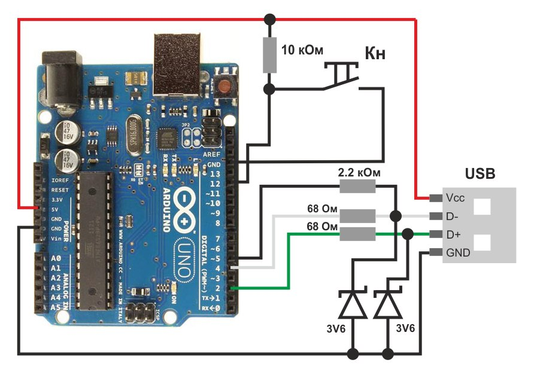

# Arduino Nano Morse-keyboard

**Arduino Nano Morse-keyboard** — USB адаптер для телеграфного ключа

Этот адаптер является основой моего проекта, представляемого на  
VIII региональном конкурсе исследовательских и проектных работ школьников  
**«Высший пилотаж — Пенза 2026»**.

Веб-версия тренажёра для работы с клавиатурой: **https://morse.entitybtw.ru**

---

## Особенности

- Бюджетная сборка — собрать адаптер можно недорого  
- Многофункциональные раскладки (смена при долгом зажатии кнопки):  
  - Английская  
  - Русская  
  - Морзе  

---

## Зависимости

1. **unoHID** — эмуляция клавиатуры  
2. **NewTone** — улучшенная библиотека для воспроизведения звука  

Все библиотеки включены в папку `libs` в корневой директории репозитория.

---

## Схема подключения необходимых компонентов

---

## Связанные проекты

- [Morse Trainer](https://github.com/entitybtw/morse-trainer) — веб-тренажёр азбуки Морзе
