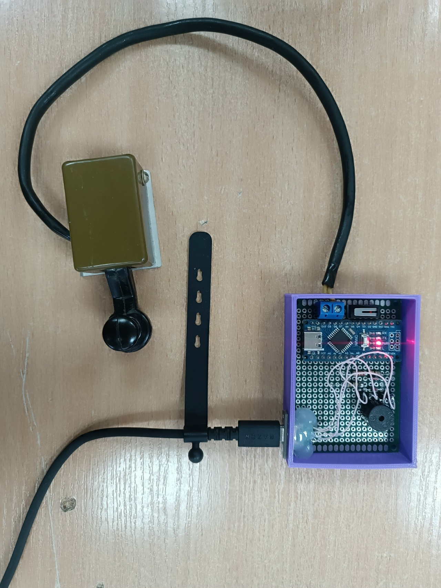
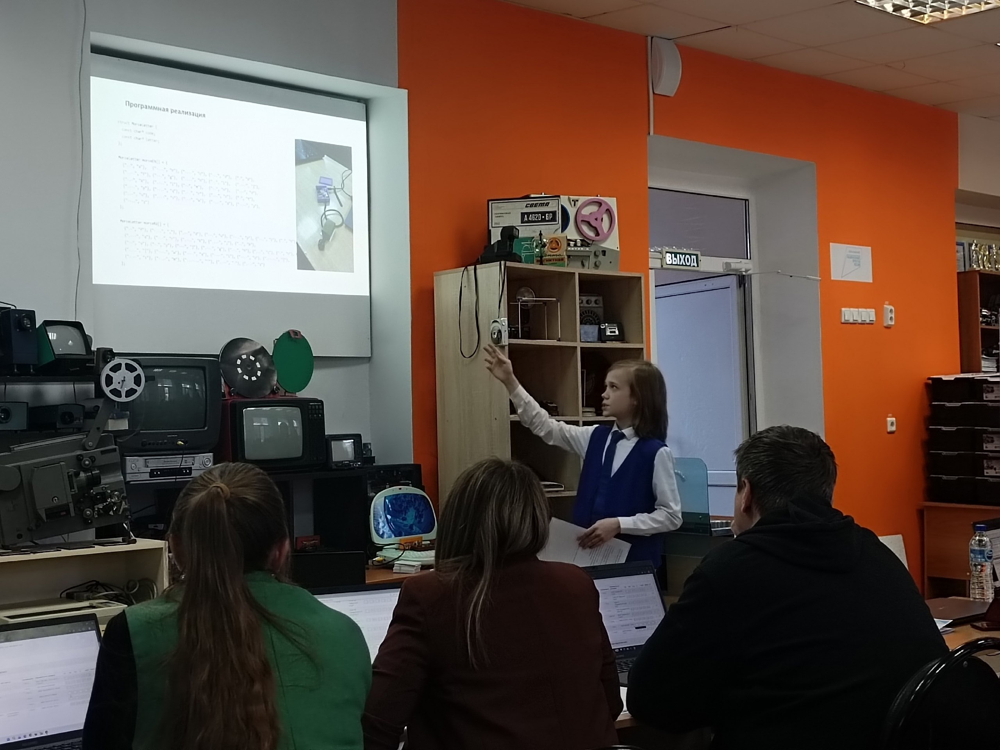
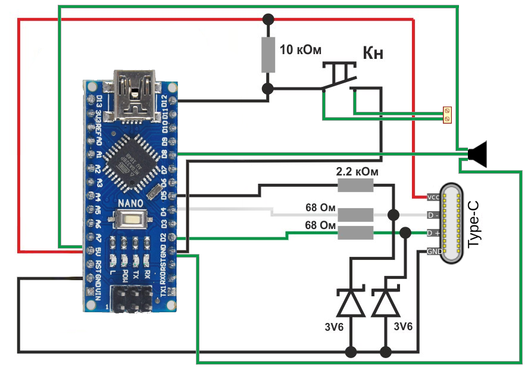

# Arduino Nano Morse-keyboard

### [russian readme version](./README.md)

**Arduino Nano Morse-keyboard** — USB adapter for a Morse telegraph key.

This adapter is the core of my project, presented at the  
VIII Regional Competition of Research and Project Works for School Students  
**“Vishiy Pilotazh — Penza 2026”**.

Web version of the keyboard training tool: **https://morse.entitybtw.ru**

---

## Features

- Budget-friendly build — the adapter can be assembled at a low cost  
- Multi-functional layouts (switching by long button hold):  
  - English  
  - Russian  
  - Morse  

---

## Dependencies

1. **unoHID** — keyboard emulation  
2. **NewTone** — improved library for sound generation  

All libraries are included in the `libs` folder in the root directory of the repository.

---

## Wiring diagram of required components

---

## Related projects

- [Morse Trainer](https://github.com/entitybtw/morse-trainer) — web-based Morse code trainer
